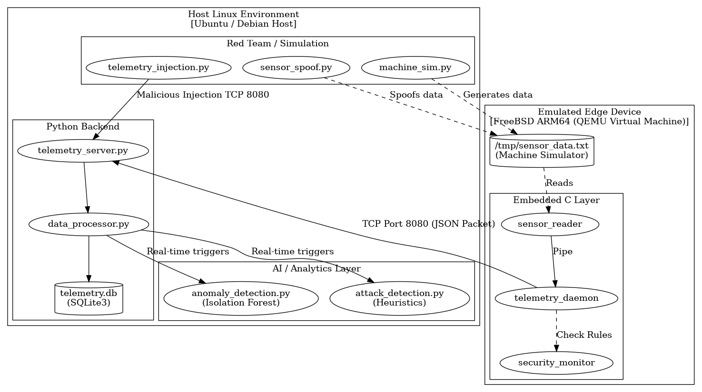

# SDD — FreeBSD ARM64 Industrial Edge AI Platform

An advanced E2E (End-to-End) platform built to demonstrate cutting-edge **Data Science, AI / MLOps, and Embedded Security (RedTeam)**.

This project simulates a secure industrial edge device running on **FreeBSD ARM64** that collects telemetry (vibration, temperature). It transports data across the network to a **Containerized Rocky Linux Data Science Backend** running an enterprise React dashboard and live Machine Learning pipelines.



## Core Portfolio Capabilities Demonstrated

### 1. Embedded C & FreeBSD ARM64
*   Writing bare-metal C applications (`sensor_reader`, `telemetry_daemon`) optimized for the ARM64 architecture.
*   Automated orchestrations using QEMU User-Networking.

### 2. Data Science & MLOps
*   **Isolation Forest Anomaly Detection**: Unsupervised machine learning models deployed locally to catch drifting metrics that human rules can't catch.
*   **Automated SQLite Persistence**: Real-time ELT ingestion architecture managed entirely via Python FastAPI.
*   **Enterprise AI Dashboard**: High-grade React (Vite) Glassmorphism dashboard leveraging Recharts for time-frequency data analysis.

### 3. RedTeam AI & Security Operations (SOC)
*   **Adversarial Machine Learning (White-Box Evasion)**: An AI attacks the AI. A fuzzer script (`adversarial_evasion.py`) loads the defensive Isolation Forest model and iterates mathematically to craft catastrophic physical bounds (e.g., 75°C temperature) that fool the classification boundary into predicting it as "Normal" telemetry.
*   **Protocol Fuzzing & Spoofing**: Simulating physical attacker intervention rewriting telemetry payloads (`sensor_spoof.py`).
*   **Data Poisoning / Injection**: Bypassing embedded defenses (`telemetry_injection.py`).
*   **Live Attack Feeds**: A fully integrated visual feed triggering when ML rules categorize data anomalies.

## Setup & E2E Testing

Running this project brings up the entire Docker pipeline and QEMU emulator out-of-the-box.

1. Ensure `qemu-system-aarch64`, `qemu-efi-aarch64` and `docker-compose` are installed.
2. Run the master operator:
   ```bash
   chmod +x all_in_one.sh
   ./all_in_one.sh
   ```
3. Open the Premium SOC Dashboard at [http://localhost:3000](http://localhost:3000).
4. Simulate Data Science Anomalies and RedTeam AI evasion algorithms using the scripts in `scripts/`:
   ```bash
   chmod +x scripts/run_redteam.sh
   ./scripts/run_redteam.sh
   ```
   Or manually with the `redteam/` python scripts.

For exhaustive documentation, read `walkthrough.md`.
