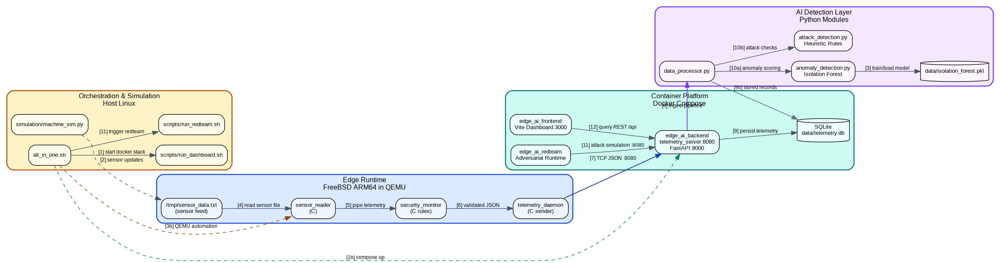

# SDD — FreeBSD ARM64 Industrial Edge AI Platform
## System Architecture

Below is the logical and physical architecture of the secure industrial edge monitoring platform.
The diagram is color-coded by domain area and rendered using Arial font:

- Blue: Edge Runtime (FreeBSD ARM64 in QEMU)
- Teal: Container Platform (Docker Compose services)
- Purple: AI Detection Layer
- Amber: Orchestration and Simulation on Host Linux

### Numbered Action Sequence

1. `all_in_one.sh` starts Docker stack (`backend` and `frontend`).
2. `machine_sim.py` updates `/tmp/sensor_data.txt`.
3. QEMU automation starts embedded runtime and model load/train path.
4. `sensor_reader` reads sensor feed.
5. `sensor_reader` pipes telemetry to `security_monitor`.
6. `security_monitor` forwards validated JSON to `telemetry_daemon`.
7. `telemetry_daemon` sends TCP JSON to backend on `:8080`.
8. Backend ingests telemetry and forwards to `data_processor.py`.
9. Data is persisted to `telemetry.db`.
10. AI layer performs anomaly and attack checks.
11. RedTeam container sends adversarial traffic to backend.
12. Frontend queries backend APIs and renders SOC panels.

### Core Components Summary

1. **Simulation Layer (`machine_sim.py`)**: Models realistic industrial vibration and temperature curves, generating `/tmp/sensor_data.txt`.
2. **Embedded C Layer (`sensor_reader`, `telemetry_daemon`)**: Reads raw hardware data and safely packages it into JSON format, transmitting it over a socket. Runs inside **FreeBSD 14.4 AArch64**.
3. **Backend / Data Processor (`telemetry_server.py`, `data_processor.py`)**: Receives high-velocity packets and stores a persistent copy into `telemetry.db` (SQLite3).
4. **AI Layer**: Real-time evaluation of telemetry against the trained Machine Learning baseline and direct cyber-attack heuristics, creating an alerting pipeline. 
5. **Red Team Layer**: Tools designed to emulate physical tampering (`sensor_spoof.py`) and network interception/injection attacks (`telemetry_injection.py`).
